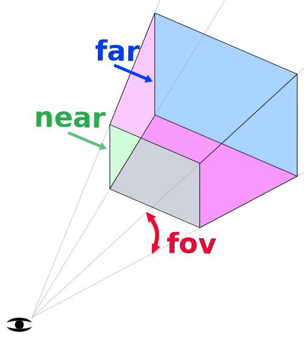

## 1、什么是GLSL？

`GLSL` 的中文意思是 `OpenGL` 着色语言，英文全称是 `OpenGL Shading Language`，它是用来在 `OpenGL` 编写 **着色器程序** 的语言。

#### 1、着色器程序

着色器程序是在显卡（GPU）上运行的简短程序，代替 **`GPU`固定渲染管线** 的一部分，使 GPU 渲染过程中的某些部分允许开发者通过编程进行控制。**着色器程序允许我们通过编程来控制 `GPU` 的渲染。**

#### 2、渲染管线流程图


+ `uniform`数据和顶点缓存区
是`javascript`中传入的数据。
+ 顶点着色器
将接收到的顶点信息，绘制成对应的坐标。
+ 图元装配阶段
是将顶点数据装配成指定**图元类型**。如点、线、三角形。
+ 光栅化阶段
将图元内部区域用空像素填充。
+ 片元着色器
为图元内部的像素填充颜色信息。

WebGL（Web Graphics Library）是一种用于在Web浏览器中进行3D图形渲染的技术，其渲染管线包括以下步骤：

+ 顶点数据输入
在渲染管线的开始，WebGL接收输入的顶点数据，通常包括顶点的位置、法线、颜色和纹理坐标等信息。这些数据可以由JavaScript代码传递给WebGL的顶点着色器。

+ 顶点着色器（Vertex Shader）
顶点着色器是WebGL渲染管线的第一个可编程阶段。在此阶段，WebGL会对输入的顶点数据进行变换，例如平移、旋转和缩放，以将顶点从模型空间变换到裁剪空间。顶点着色器可以由开发者自定义，使用GLSL（OpenGL Shading Language）进行编写。

+ 图元装配（Primitive Assembly）
在图元装配阶段，WebGL将经过顶点着色器处理后的顶点数据组装成三角形、线段或点等图元，以便后续的光栅化操作。

+ 光栅化（Rasterization）
在光栅化阶段，WebGL将图元转换为像素，并确定每个像素的位置和颜色。这一阶段涉及到裁剪、投影和透视等操作，以便将3D图形映射到2D屏幕上。

+ 片元着色器（Fragment Shader）
片元着色器是WebGL渲染管线的一个重要阶段。在此阶段，WebGL会对光栅化阶段输出的像素进行处理，并根据着色器程序计算出每个像素的最终颜色。片元着色器通常用于实现光照、纹理映射、阴影等效果。

+ 像素操作（Pixel Operations）
在片元着色器输出最终颜色后，WebGL可能会对像素进行一些操作，例如深度测试、模板测试、混合等，以决定最终将哪些像素显示在屏幕上。

+ 帧缓冲（Frame Buffer）
在渲染管线的最后一步，WebGL将所有的像素数据存储到帧缓冲中。帧缓冲是用于存储渲染结果的内存区域，它可以被复制到屏幕上，或者用于其他的后期处理。

+ 输出到屏幕
渲染管线完成后，WebGL会将帧缓冲中的渲染结果输出到屏幕上，从而在Web浏览器中显示渲染的3D图形。

以上是WebGL渲染管线的主要步骤


#### 3.GLSL中的数据类型
#####  3.1向量
向量按照维度分为2维、3维、4维，按照存储的数据类型分为浮点向量vec{n}，整型向量ivec{n}，布尔向量bvec{n}。
**浮点向量**
+ vec2：存储2个浮点数。
+ vec3：存储3个浮点数。
+ vec4：存储4个浮点数。
**整型向量**
+ ivec2：存储2个整数。
+ ivec3：存储3个整数。
+ ivec4：存储4个整数。

**布尔向量**
+ bvec2：存储2个布尔值。
+ bvec3：存储3个布尔值。
+ bvec4：存储4个布尔值。

**向量的使用技巧**
每个向量我们都可以用 {s、t、p、q},{r、g、b、a},{x、y、z、w}来表示。获取各个位置的元素，我们可以使用.操作符。
```ini
vec4 v = vec(1, 2, 3, 4);
```
那么v.s、v.r、v.x、v[0]表示的是该向量第 1 个位置的元素。
同理：
+ v.t、v.g、v.y、v[1]表示的是该向量第 2 个位置的元素。
+ v.p、v.b、v.z、v[2]表示的是该向量第 3个位置的元素。
+ v.q、v.a、v.w、v[3]表示的是该向量第 4 个位置的元素。
以 v 的前两个元素创建一个 2 维向量 v1，那么我们可以这样赋值：
```ini
vec4 v = vec4(1, 2, 3, 4);

// xyzw 方式赋值
vec2 v1 = v.xy;
// stpq 赋值
vec2 v1 = v.st;
// rgba 赋值
vec2 v1 = v.rg;

// 构造函数式
vec2 v1 = vec2(v.x, v.y);
vec2 v1 = vec2(v.s, v.t);
vec2 v1 = vec2(v.r, v.g);
```
也可以像下面那样
```ini
vec4 v = vec4(1, 2, 3, 4)
vec2 v1 = vec2(v.xx);
```

**向量的运算规则**

向量与常数之间的运算比较简单，就不说了。在数学领域，向量之间还有**点乘**和**叉乘**。
GLSL 中增加了两种内置函数，用来实现点乘和叉乘运算，它们分别是 dot和cross。
+ **点乘** 
点乘的几何意义是两个向量的模相乘然后再乘以夹角的余弦。经常会使用点乘判断两个向量夹角大小。
通常只求夹角的话，一般先将两个向量归一化，这样就不用再去计算向量模了，直接取点乘结果即可。
```ini
float v3 = dot(v1, v2);  
```

+ **叉乘**
两个向量叉乘结果是一个新向量，新向量的方向垂直于原来两个向量所在的平面，方向可以通过右手定则来判定，大小等于两个向量模的乘积再乘以向量夹角的正弦值，即向量组成的平行四边形的面积。
```ini
vec3 v3 = cross(v1, v2);
```

利用右手定则，当右手的四指从向量 a 以不超过 180 度的转角转向 b 时，竖起的大拇指指向是叉乘结果向量的方向。


3D 编程中经常使用的向量运算有以下几种。
+ 点积 
+ 叉积
+ 归一化向量
+ 向量长度
+ 两个向量之间的距离
+ 向量基本运算（相加 、相减、相乘、相除）

**向量的表示方式**
`GLSL` 程序中有一个向量数据结构 vec，我们经常使用它来定义点坐标或者向量。如何判断 P 代表向量还是代表顶点坐标呢？通常使用**齐次坐标系**来解决这种混乱。
```ini
vec3 p = vec3(x, y, z);
```
+ 齐次坐标系：齐次坐标系使用 `N + 1` 维向量来表示 N 维点坐标和 N 维向量。3维坐标系中，有一个点(X, Y, Z)，那么在齐次坐标系中会使用 4 维向量来表示它 (X, Y, Z, W)。
**注意：** W 为 0 时代表向量。W 不为 0 代表点。
齐次坐标除了能够区分点和向量，还有两大用处：
> 1、模拟透视投影效果。
> 2、用矩阵来表示平移变换。

##### 3.2 矩阵

**矩阵分类**
矩阵按照维度分为二阶、三阶、四阶，其中三阶和四阶矩阵用的较多。
四阶矩阵有多种构造方式。mat4构造函数 中传入的数字只要满足 16 个就可以构造成四阶矩阵。
+ 用 16 个浮点数构造
```ini
mat4 m = mat4(
    1, 2, 3, 4,  //第一列
    5, 6, 7, 8,  //第二列
    9, 10, 11, 12, //第三列
    13, 14, 15,16 // 第四列
);
```
+ 用 1 个浮点数构造对角线矩阵。
```ini
mat4 a = mat4(1.0);
```
+ 利用列向量构造
```ini
//第一列
vec4 c0 = vec4(1, 2, 3, 4);
//第二列
vec4 c1 = vec4(5, 6, 7, 8);
//第三列
vec4 c2 = vec4(1, 2, 3, 4);
//第四列
vec4 c3 = vec4(5, 6, 7, 8);
mat4 m = mat4(c0, c1, c2, c4);
```
+ 向量与浮点数混合构造
```ini
vec4 c0 = vec4(1, 2, 3, 4);
vec4 c1 = vec4(5, 6, 7, 8);
vec4 c2 = vec4(1, 2, 3, 4);

mat4 m = mat4(c0, c1, c2, 5, 6, 7, 8);

```
3D 编程中经常用到的矩阵运算有以下几种。
+ 单位化矩阵
+ 矩阵基本运算
    + 矩阵相加。
    + 矩阵相减。
    + 矩阵相乘。
    + 转置矩阵
    + 逆矩阵
+ 旋转矩阵
    + 绕 X 轴旋转。
    + 绕 Y 轴旋转。
    + 绕 Z 轴旋转。
    + 绕轴向量旋转。
    + 根据欧拉角推导旋转矩阵。
    + 根据四元数推导旋转矩阵。
    + 旋转矩阵与欧拉角、四元数之间的变换。
+ 平移
    + 沿 X 轴平移。
    + 沿 Y 轴平移。
    + 沿 Z 轴平移。
+ 缩放
    + 沿 X 轴缩放。
    + 沿 Y 轴缩放。
    + 沿 Z 轴缩放。
+ 观察矩阵
    + 正射投影矩阵
    + 透视投影矩阵

**矩阵运算**
+ 矩阵相乘
矩阵相乘不满足交换律。左乘和右乘的结果不一定相同。矩阵跟标量相乘比较简单，就不说了。
  + 矩阵与矩阵相乘
  矩阵与矩阵相乘也要满足一定条件，假设两个矩阵能够相乘：
  `P = M ✖️ N` 那么，他们之间必须满足以下条件：**M 的列数等于 N 的行数**。
  一个 m 行 n 列矩阵 乘以 n 行 q 列矩阵，所得到的新矩阵为 m 行 q 列，即 m行n列 * n行q列 = m行q列。

  + 矩阵与向量相乘
矩阵与向量相乘其实等价于矩阵与一阶矩阵相乘，其实质是将向量变换为另一个向量，但是要注意乘法的顺序。
假设有一个4 维向量 P 和一个4 阶方阵 M，当 P 左乘 M 时，P 一定要表示成行向量，即 1 * 4 矩阵。当 P 右乘 M 时，P要表示成列向量，即 4 * 1 矩阵。

**转置矩阵**
矩阵转置就是将原来矩阵的行向量转变为列向量，矩阵 M的转置矩阵用符号 M^T来表示，假设有一个矩阵M：


**逆矩阵**
假设有一个 m 阶方阵 A ，如果存在一个n 阶方阵 B，使得 A ✖️ B = B ✖️ A = I 其中 I 是单位矩阵，那么 B 是 A 的逆矩阵， A 矩阵就是可逆矩阵，也称非奇异矩阵，矩阵 A 的逆矩阵 用 A^-1 表示。**单位矩阵**首先是一个方阵，其次方阵对角线上的元素都为 1，其余元素为 0。
**逆矩阵首先必须是方阵**，其次存在另一个矩阵与之相乘，能够得到一个单位矩阵。

**利用逆矩阵可以将变换后的坐标再还原回去**。

**正交矩阵**
假设有一个方阵M，当且仅当 M 与其转置矩阵M^T的乘积等于单位矩阵时，称其为正交矩阵。即： M ✖️ M^T = I，那么就有 M^T = M^-1.
一个矩阵是正交矩阵，那么计算它的逆矩阵时，只需要对原矩阵转置即可。
那么矩阵 M 是正交矩阵的充分必要条件是：
+ 矩阵的每一行都是单位向量.
+ 矩阵的某一行和其他行向量相互垂直，点积为 0。

绕X轴旋转一定角度的旋转矩阵就是一个正交矩阵：


##### 3.3 内置函数

**向量函数**
+ cross	计算两个向量的叉积
+ dot	计算向量的点积。
+ normalize	归一化向量，返回一个和原向量方向相同，但是长度为1的单位向量。
+ reflect	根据入射向量和法线向量，计算出反射向量。
+ length	计算向量的长度
+ distance	计算两个向量之间的距离。
**常用数学函数**
+ abs	将某个数的绝对值
+ floor	返回不大于某个数的最大整数。
+ round	四舍五入值
+ ceil	返回大于某个数的最小整数。
+ fract	返回浮点数的小数部分
+ mod	取模
+ min	返回两个数中比较小的数
+ max	返回两个数中比较大的数

**三角函数**
+ radians	将角度（如90度）转化为弧度（PI/2）。
+ degrees	将弧度（如PI / 2）转化为角度（90 度）。
+ sin	求弧度的正弦
+ cos	求弧度的余弦
+ tan	求弧度的正切
+ asin	根据正弦值求对应的弧度
+ acos	根据余弦值求对应的弧度
+ atan	根据正切值求对应的弧度

## 2、内置变量
|  内置变量   | 含义  | 值数据类型
|  ----  | ----  | ----
| gl_PointSize  | 点渲染模式，正方形点区域渲染像素大小 | float
| gl_Position  | 顶点位置坐标 | vec4
| gl_Normal  | 顶点法线 | vec2
| gl_FragColor  | 片元颜色值 | vec4
| gl_FragCoord  | 片元坐标，单位像素 | vec2
| gl_PointCoord  | 点渲染模式对应点像素坐标 | vec2
| gl_FragDepth  | 片元的最终深度值，在后面的深度测试用到，在片元着色器中我们无法修改x, y值，但是可以修改z值。 | vec2
### 1、gl_PointSize
内置变量 `gl_PointSize` 主要是用来设置顶点渲染出来的方形点像素大小。值是一般是在绘制函数 `gl.drawArrays()` 绘制模式是点模式 `gl.POINTS` 的时候使用。
```js
void main() {
  //给内置变量gl_PointSize赋值像素大小，注意值是浮点数
  gl_PointSize=10.0;
}

//绘制函数绘制模式：点gl.POINTS
/*
gl.POINTS表示绘制类型，0表示从第1个数据开始绘制，4表示绘制4个点
*/
gl.drawArrays(gl.POINTS,0,4);
```
### 2、gl_Position
`gl_Position` 内置变量表示最终传入片元着色器片元化要使用的顶点位置坐标。如果有多个顶点，每个顶点都要执行一遍顶点着色器主函数`main` 中的程序。
```js
attribute a_posotion;
void main(){
    //逐顶点处理数据
    gl_Position = a_posotion;
}
```
**顶点传递数据**
```js
const aposLocation = gl.getAttribLocation(program,'a_posotion');
//类型数组构造函数Float32Array创建顶点数组
const data=new Float32Array([0.5,0.5,-0.5,0.5,-0.5,-0.5,0.5,-0.5]);
//创建缓冲区对象
const buffer=gl.createBuffer();
//绑定缓冲区对象,激活buffer
gl.bindBuffer(gl.ARRAY_BUFFER,buffer);
//顶点数组data数据传入缓冲区
gl.bufferData(gl.ARRAY_BUFFER,data,gl.STATIC_DRAW);
//缓冲区中的数据按照一定的规律传递给位置变量aposLocation
gl.vertexAttribPointer(aposLocation,2,gl.FLOAT,false,0,0);
//允许数据传递(这句代码放在能获取到aposLocation的任意位置都可以)
gl.enableVertexAttribArray(aposLocation);
```
### 3、gl_FragColor
`gl_FragColor` 内置变量主要用来设置片元像素的颜色，出现的位置是片元着色器语言的 `main` 函数中。包含 4 个分量 `(R, G, B, A)`，各个颜色分量的取值范围是`【0，1】`，也不同于我们常规颜色的`【0，255】`取值范围，所以当我们给 `gl_FragColor` 赋值时，也需要对其进行转换。平常我们所采用的颜色值`（R, G, B, A）`，对应的转换公式为： `(R值/255，G值/255，B值/255，A值/1）`。
```js
  void main() {
    // 设置片元颜色为红色
    gl_FragColor = vec4(1.0,1.0,0.0,1.0);
  }
```
**纹理采样**
```js
// 接收插值后的纹理坐标
varying vec2 v_TexCoord;
// 纹理图片像素数据
uniform sampler2D u_Sampler;
void main() {
  // 采集纹素，逐片元赋值像素值
  gl_FragColor = texture2D(u_Sampler,v_TexCoord);
}
```
### 4、gl_PointCoord
渲染点片元坐标。一个顶点渲染为一个正方形区域，每个正方形区域以正方向区域的左上角建立一个直角坐标系，然后使用内置变量`gl_PointCoord` 描述正方形区域中像素或者说片元的坐标，比如正方形区域的左上角坐标是 `(0.0,0.0`),正方形区域几何中心坐标是 `(0.5,0.5)`，右下角坐标是`(1.0,1.0)`。 图片来源于网络


**`gl_PointCoord` 在片元着色器中的应用** 
```js
precision lowp float;
void main(){
    float r = distance(gl_PointCoord, vec2(0.5, 0.5));
    //根据距离设置片元
    if(r < 0.5){
        // 正方形区域片元距离几何中心半径小于0.5，像素颜色设置红色
        gl_FragColor = vec4(1.0,0.0,0.0,1.0);
    }else {
        // 正方形区域距离几何中心半径不小于0.5的片元剪裁舍弃掉：
        discard;
    }
}
```
下面是使用 `gl_pointCoord`裁剪成 **圆形** 的图片和没有被裁减的 **正方形** 的图片对比情况。
<div style='text-align:center'>

</div>

### 5、gl_FragCoord
内置变量 `gl_FragCoord` 表示 `WebGL` 在 `canvas` 画布上渲染的所有片元或者说像素的坐标。坐标原点是 `canvas` 画布的左上角，水平向右方向是 `x` 轴正向，竖直向下方向为 `y` 轴正方向。，`gl_FragCoord` 坐标的单位是像素，`gl_FragCoord` 的数据类型是`vec2`, 通过 `gl_FragCoord.x`、`gl_FragCoord.y` 可以分别访问片元坐标的纵横坐标。

**`gl_FragCoord` 在片元着色器中的应用** 
```js
void main(){
    // 根据片元的x坐标，来设置片元的像素值
    if(gl_FragCoord.x < 200.0){
        //默认为 canvas原来的颜色
    }
    else if (gl_FragCoord.x < 250.0) {
        // canvas画布上[0,300)之间片元像素值设置
        gl_FragColor = vec4(1.0, 0.0, 0.0, 1.0);
    } else if (gl_FragCoord.x <= 300.0) {

        // canvas画布上(300,400]之间片元像素值设置 绿色
        gl_FragColor = vec4(0.0, 1.0, 0.0, 1.0);
    } else {
        // canvas画布上(400,500]之间片元像素值设置 蓝色
        gl_FragColor = vec4(0.0, 0.0, 1.0, 1.0);
    }
}
```
结果如下图所示：


## 3、限定符之attribute和uniform以及constying的区别
`attribute` 和 `uniform` 关键字的目的主要是为了 `javascript` 语言可以通过相关的WebGL API把一些数据传递给着色器。而`varing` 主要是将顶点着色器中的数据传递给片元着色器。
| 变量类型 | 数据传递方向 | 作用
| ---- | ---- | ----
| attribute  | 从js脚本中传递到顶点着色器 | 只能定义在顶点着色器中，接收 JavaScript 程序传递过来的与顶点有关的数据，如顶点颜色、法线、坐标等顶点的属性
| uniform  | 从js脚本中传递到顶点、片元着色器 | 在一个帧渲染过程中保持不变的变量，是所有顶点都共有的数据,在着色器中声明非顶点数据(如光源位置数据、方向数据、矩阵数据)。用来接收与顶点无关的数据。
| varying  | 从顶点着色器传递到片元着色器 | 成对定义的，即在顶点着色器中定义，在片元着色器中使用。一般用来在顶点着色器和片元着色器之间传递数据，在顶点着色器中声明需要插值计算的顶点数据

`varying`数据，需要同时在顶点着色器和片元着色器中声明。`varying` 类型变量主要是为了完成顶点着色器和片元着色器之间的数据传递和插值计算
**在顶点着色器**
```js
attribute vec4 a_color;// attribute声明顶点颜色变量
varying vec4 v_color;//constying声明顶点颜色插值后变量
void main() {
  //顶点颜色插值计算
  v_color = a_color;
}
```
**片元着色器**
```js
// 接收顶点着色器中v_color数据
varying vec4 v_color;
void main() {
  // 插值后颜色数据赋值给对应的片元
  gl_FragColor = v_color;
}
```
## 4、enable
用于启用各种功能。功能由参数决定。与 `disable` 相对应。`disable` 是用来关闭的。两个函数参数取值是一至的。参数主要有以下这些：

+ `gl.DEPTH_TEST`：启用深度测试。根据(坐标离相机的远近)自动隐藏被遮住的图形。按理说 Z 轴越小的越靠近视野，就会显示在前面。其实，在深度检测不开启的情况下，哪个顶点越靠后绘制，哪个顶点就绘制在前面，这时 Z 轴坐标不再决定顶点是否绘制在前面。
+ `gl.CULL_FACE`：启用隐藏图形材料的面
+ `gl.BLEND`：α融合,激活片元的颜色融合计算
#### 1、透明度融合
比如源颜色像素值是 `(R1,G1,B1,A1)`,目标颜色像素值是 `(R2,G2,B2,A2)`，融合后的像素值计算方法如下：
```js
R3 = R1 x A1 + R2 x (1 - A1)

R3 = G1 x A1 + G2 x (1 - A1)

R3 = B1 x A1 + B2 x (1 - A1)
```
如果后绘制的面不透明，相当于 `A1`等于1，代入上面的公式 `1 - A1` 就表示0，也就是说先绘制面的像素值被完全覆盖；如果后绘制的面完全透明，`A1` 是0，那么 `R1 x A1` 结果就是0， 也就是说绘制的面无论它是什么颜色，融合后的像素值就是后面物体的像素，也就是说后绘制的三角面你看不到它的存在。
```js
/**
 * 表示开启GPU渲染管线α融合功能单元配置
 **/
gl.enable(gl.BLEND); //gl.BLEND表示α融合，实现颜色融合叠加
gl.blendFunc(gl.SRC_ALPHA,gl.ONE_MINUS_SRC_ALPHA);
```
## 5、WebGL坐标系
#### 5.1`WebGL`坐标系的分类：
模型坐标系——>世界坐标系——>观察坐标系(又称相机坐标系、视图坐标系)——>裁剪坐标系(`gl_Position`接收的值)——>NDC坐标系——>屏幕坐标系。
> 裁剪坐标系之前的这几个坐标系，我们都可以使用 JavaScript 控制。从裁剪坐标系到 NDC 坐标系，这一个步骤是 顶点着色器的最后自动完成的，我们无法干预。

**模型坐标系**：一个物体通常由很多点构成，每个点在模型的什么位置？我们需要用一个坐标系来参照，这个坐标系就叫模型坐标系，**模型坐标系原点通常在模型的中心**，各个坐标轴遵循右手坐标系，即 X 轴向右，Y 轴向上，Z 轴朝向屏幕外。

**世界坐标系**：默认情况模型坐标系和世界坐标系重合。如果模型不在世界坐标系中心，那么就需要对模型坐标系进行转换，将模型的各个相对于模型中心的顶点坐标转换成世界坐标系下的坐标。
举个例子，假如模型中有一点 P ，相对于模型中心的坐标（1，1）。 该模型在世界坐标系的（3，0）位置，那么，顶点 P 在世界坐标系中的坐标就变成了（4，1）。

**观察坐标系**：将世界空间坐标转化为用户视野前方的坐标而产生的结果。人眼或者摄像机看到的世界中的物体相对于他自身的位置所参照的坐标系就叫观察坐标系。**是以人眼/摄像机为原点而建立的坐标系**。

**裁剪坐标系**：将相机坐标进行**投影变换**后得到的坐标，也就是 `gl_Position` 接收的坐标。裁剪坐标系遵循**左手坐标系**。
相机坐标系观察的空间是整个 3D 世界，而裁剪坐标系是希望所有的坐标都落在一个特定的范围内，超出这个范围的顶点坐标都将被裁剪掉，被裁剪掉的坐标就不会显示，这就是裁剪坐标系的由来。

投影矩阵会创建一个观察箱 `Viewing Box`，称为平截头体`Frustum`，出现在平截头体范围内的坐标最终都会显示在屏幕上。裁剪坐标系中的坐标转化到标准化设备坐标系的过程就很容易，这个过程被称之为投影`Projection`，

观察坐标变换为裁剪坐标的投影矩阵可以为两种不同的形式，每种形式都定义了不同的平截头体。
+ 正射投影矩阵：又名正交投影，正射投影矩阵创建的是一个立方体的观察箱，它定义了一个裁剪空间，在该裁剪空间之外的坐标都会被丢弃。 正射投影矩阵需要指定观察箱的长度、宽度和高度。经过正射投影矩阵映射后的坐标 `w` 分量不会改变，始终是 1，所以在经过透视除法后物体的轮廓比例不会发生改变，这种投影一般用在建筑施工图纸中，不符合人眼观察世界所产生的近大远小的规律。
+ 透视投影矩阵:透视投影矩阵将给定的平截头体范围映射到裁剪空间，除此之外它还会修改每个顶点坐标的 `w` 值，使得离人眼越远的物体的坐标 `w` 值越大。被变换到裁剪空间的坐标都会在 `-w` 到 `w` 的范围之间（任何大于这个范围的坐标都会被裁剪掉）。`WebGL` 要求所有可见的坐标都落在`【-1.0 - 1.0】`范围内，因此，一旦坐标转换到裁剪空间，透视除法就会被应用到裁剪坐标上。透视投影需要设置**近平面、远平面、透视深度**。

**NDC坐标系**：一旦所有顶点被变换到裁剪空间，`GPU` 会对裁剪坐标执行透视除法，在这个过程中 `GPU` 会将顶点坐标的 `X，Y，Z` 分量分别除以齐次 `W` 分量。这一步会在每一个顶点着色器运行的最后被自动执行。最终所有坐标分量的范围都会在 `【-1，1】`之间，超出这个范围的坐标都将被 `GPU` 丢弃。
`NDC` 坐标系遵循左手坐标系，`Z` 轴朝向屏幕里面，`Z` 轴值越小，越靠近我们的眼睛

**屏幕坐标系**：有了 `NDC` 坐标之后，`GPU` 会执行最后一步变换操作，视口变换，这个过程会将所有在`【-1, 1】`之间的坐标映射到屏幕空间中，并被变换成片段。

**坐标转换流水线**
+ `CPU`中将模型坐标转换成裁剪坐标
  + 顶点在模型坐标系中的坐标经过模型变换，转换到世界坐标系中。主要变换有平移、旋转和缩放(模型变换)
  + 然后通过摄像机观察这个世界，将物体从世界坐标系中转换到观察坐标系。(视图变换)
  + 进行投影变换，将物体从观察坐标系转换到裁剪坐标系。(投影变换)
+ `GPU`接收`CPU`传递过来的裁剪坐标。
  + 接收裁剪坐标，通过透视除法，将裁剪坐标转换成 `NDC` 坐标。(透视除法)
  + `GPU` 将 `NDC` 坐标通过视口变换，渲染到屏幕上。将 3D 坐标转变成 2D 坐标，在 GPU 中执行，我们无法通过编程干预。(视口变换)
  ```js
  //设置视口 宽500 高300
  gl.viewport(0, 0,  500, 300);
  ```
**坐标转换公式**
+ 将标准屏幕坐标转化为CSS坐标
```js
const x = canvas.clientWidth / 2 + tempV.x * canvas.clientWidth / 2; // 
const y = canvas.clientHeight / 2 - tempV.y * canvas.clientHeight / 2;
```

#### 5.2 变换矩阵的推导
**变换矩阵的求解思路**

+ 1.求出新坐标系原点在原坐标系中的位置。
+ 2.求出新坐标系基向量在原坐标系中的表示。

对物体（顶点）做平移、旋转、缩放的变换操作相当于对原来的坐标系做平移、旋转、缩放变换，**得到一个新坐标系**。
+ 首先求出新坐标系的基向量 U 在原坐标系下的表示 U’，其中 `U = (Ux, Uy, Uz)， U' = (Ux', Uy', Uz')`。
  + Ux：X轴基向量，由三个分量构成，Uxx, X轴分量; Uxy, Y轴分;。Uxz，Z轴分量。
  + Uy：Y轴基向量，由三个坐标轴分量组成 `Uyx`：X轴分量。Uyy：Y轴分量。Uyz：Z轴分量。
  + Uz：Z轴基向量，由三个坐标轴分量组成. Uzx：X轴分量。Uzy：Y轴分量。Uzz：Z轴分量。

+ 其次求出新坐标系的坐标原点`O(Ox, Oy, Oz)` 在原坐标系下的坐标 `O1（Ox1, Oy1, Oz1`。
> **基向量**是指坐标系中各个坐标轴正方向的单位向量，假设 Ux 代表 X 轴的单位向量，那么 Ux = (1, 0, 0)，同理， Uy = (0, 1, 0)，Uz = (0, 0, 1)。
求解坐标变换矩阵关键就是要找到原坐标系的基向量在新坐标系中的表示。
+ 将上面求出的各个值代入下面的矩阵框架。


下面是一个坐标系变换的例子，坐标系 `oxyz` 绕 Z 轴旋转 β 角度后形成了新坐标系 `ox'y'z'`：

按照求解思路的第一步，新坐标系的基向量在原坐标系表示为：
```ini
U' =  (Ux', Uy', Uz')
Ux' = (cos(β), sin(β), 0)
Uy' = (-sin(β), cos(β), 0)
Uz' = (0, 0, 1)
```
原坐标系的坐标原点和新坐标系重合。
```ini
O1 = (Ox1 ,Oy1, Oz1) = (0, 0, 0)
```
代入通用矩阵框架后得出变换矩阵为：
;
**平移变换的变换矩阵**

**缩放变换的变换矩阵**

**绕任意轴旋转**
待续....

#### 5.3 坐标系变换的分类
可控制的坐标系变换分为3类，分别是：
+ 模型变换
模型变换负责将模型坐标转换成世界坐标。
+ 视图变换
视图变换负责将世界坐标转换成相机坐标。
+ 投影变换
投影变换负责将相机坐标转换成裁剪坐标，也就是将 3D 坐标投影到 2D 平面上。
变换矩阵相乘的顺序为：
```ini
F = P ✖️ V ✖️ M
```

变换矩阵为 F，模型矩阵为 M， 视图矩阵为 V，投影矩阵为 P。

模型变换是由多个基本变换组合而成，那么对矩阵而言，就是由多个基本变换矩阵相乘而得到，既然提到相乘，那么相乘的顺序就至关重要。

**5.3.1 模型变换**
先缩放，再旋转，最后再平移。
模型变换公式如下所示：
```ini
M = T(平移矩阵) ✖️ R(旋转矩阵) ✖️ S(缩放矩阵)
```
**5.3.2 视图变换**

世界空间转变到观察空间这个过程通常称为视图变换，变换矩阵称为视图矩阵。在做视图变换之前，我们会在世界坐标系里指定摄像机或者人眼的位置`eyePosition`，以及摄像机头顶方向向量 `upDirection`，然后我们要根据这两个条件计算出视图变换矩阵。

新坐标系是观察坐标系，原坐标系是世界坐标系，我们已经知道的是世界坐标系下的顶点位置 P0，需要求出顶点在观察坐标系中的位置 P1。
```ini
P1 = M ✖️ P0
```
`M` 是世界坐标系变换到观察坐标系的观察矩阵。为了求出 `M`，需要知道 世界坐标系的原点在观察坐标系中的位置，还需要知道世界坐标系基向量在观察坐标系中的表示。

定义观察坐标系变换到世界坐标系的矩阵为**相机矩阵 `E`**，世界坐标系变换到观察坐标系的矩阵为**视图矩阵 `V`**，其中 `E` 和 `V` 互逆。 `E ✖️ V = I`,`I`为单位矩阵。

**求解相机矩阵**
已知：
+ 1.假设相机在世界坐标系中的位置 `Pe (ex, ey, ez)`。
+ 2.看向目标位置为`T (tx,ty,tz)`。
+ 3.摄像机上方方向向量 `upDirection` 为 `(ux, uy, uz)`。

**1.求解相机坐标系的基向量在世界坐标系中的表示**
+ 从相机位置看像目标位置的方向称为观察方向，观察方向可以看做相机坐标系的 Z 轴方向，那么世界坐标系的 Z 轴基向量方向可以这样求出：
  ```js
  zAxis = Pe - T = (ex - tx, ey - ty, ez - tz);
  ...
  function lookAt(cameraPosition, target, upDirection){
    const zAxis  = (Vector3.subtractVectors(cameraPosition, target)).normalize();
  }
  ```
+ 有了 Z 轴方向向量 `zAxis` 和临时 Y 轴 方向 `upDirection`，我们就可以利用向量叉乘来计算 X 轴方向。
  ```js
  xAxis = zAxis ✖️ upDirection;
  ...
  const xAxis = (Vector3.cross(upDirection, zAxis)).normalize();
  // 处理 zAxis 和 upDirection 平行的情况：
  if(xAxis.length() == 0){
    if (Math.abs(upDirection.z == 1)) {
      zAxis.x += 0.0001;
    } else {
      zAxis.z += 0.0001;
    }
    zAxis.normalize();
    xAxis = Vector3.cross(upDirection, zAxis).normalize();
  }
  ```
+ 这时还需要求一遍 Y 轴的方向向量，因为 `upDirection` 是我们一开始假想的，只是为了求解 X 轴方向，**`upDirection` 和 `zAxis` 不一定是垂直关系。**

  ```js
  yAxis = zAxis ✖️ xAxis;
  ...
  const yAxis = (Vector3.cross(zAxis, xAxis)).normalize();
  ```
+ 将 `xAxis(xx, xy, xz)、yAxis(yx, yy, yz)、zAxis(zx, zy, zz)` 以及相机位置 `Pe(ex, ey, ez)` 代入矩阵变换框架，可以求得相机坐标系变换到世界坐标系的相机矩阵 `E`。
相机矩阵如下所示：

利用逆矩阵的算法求出 E 的逆矩阵 `E^-1`，即视图矩阵。
利用视图矩阵左乘顶点在世界坐标系的坐标，计算出顶点在观察坐标系中的坐标，也就完成了世界坐标系到观察坐标系的变换。

**2.相机矩阵的使用**
+ 首先定义摄像机的位置：
```ini
const cameraPosition = new Vector3(0, 0, 10);
```
+ 接着指定视线看向的点：
```ini
const target = new Vector3(0, 0, 0);
```
+ 假定一个方向向量代表摄像机上方：
```ini
const upDirection = new Vector3(0, 1, 0);
```
+ 参数代入 lookAt 方法，求出相机矩阵：
```ini
const cameraMatrix = matrix.lookAt(cameraPosition, target, upDirection);
```
+ 最后一步，求相机矩阵的逆矩阵，即观察矩阵。
```ini
const viewMatrix = matrix.inverse(cameraMatrix);
```

**5.3.3投影变换**
观察空间也沿用了右手坐标系，即 Z轴正向朝向屏幕外侧，但是裁剪坐标系是左手坐标系，即 Z 轴正向朝向屏幕内侧，那么在投影变换阶段，我们除了要将 3D 坐标投影到 2D 平面，还要将右手坐标系变换成左手坐标系。分为正交投影、透视投影。
+ 正交投影，可视范围是一个立方体盒子。

+ 透视投影，可视范围是一个棱锥体盒子


**正交投影矩阵推导过程如下：**

正交投影盒中的一点 `P(x, y, z)` ，投影后的点 `P'（x',y',z'）`, `x',y',z'` 的值都在 `[-1,1]` 之间。`(left,right,top,bottom,zNear,zFar)`,遵循的是右手坐标系。z轴正向只想屏幕外。相所以 `zNear` 是大于 `zFar`。
> x' 和 x 的关系
```js
// (left+right)/2 为 x轴的原点
// (right-left)/2 为 x的正向最大值
x' = (x- (left+right)/2)/(right-left)/2;
```
> y' 和 y 的关系
```js
y' = (y- (top+bottom)/2)/(top-bottom)/2;
```
> y' 和 y 的关系
```js
z' = (z- (zFar+zNear)/2)/(zNear-zFar)/2;
```
将上面的 x'、y'、z'代入上式，即可求出正交投影矩阵：


**透视投影矩阵推导过程如下：**
将可视范围内的所有物体坐标投影到近平面上，投影后的坐标根据相似三角形原理求得，比较简单。
通过上面透视投影示例图，根据相似三角形原理，我们可以知道如下关系：
```js
zNear/z = y1/y = x1/x;
x1 = zNear*x/z;
y1 = zNear*y/z;
```
其中 `x1` 和 `y1` 是相机坐标系坐标经过视线看向物体后**在近平面上的交点坐标**。此时 `x1` 和 `y1` 还是相机坐标系下坐标，并没有变换到裁剪坐标系，还要将 `x1` 和 `y1` 变换到`[-1，1]`之间。

所以有：
```js
x' = x1/(with/2) = zNear*x/(z*(width/2));
y' = y1/(height/2) = zNear*x/(z*(height/2));
```
透视投影矩阵过程整理中。。。。


## 6、纹理贴图
简单的所就是将 `png、jpg` 等格式图片显示在 `WebGL` 三维场景中。例如往三维模型上贴商标。

在着色器中图片的坐标称为**纹理坐标**，图片称为**纹理图像**，图片上的一个像素称为**纹素**，一个纹素就是一个 `RGB` 或者`RGBA`值。把整个图片看成一个平面区域，用一个二维`UV`坐标可以描述每一个纹素的位置。下图来源于网络。


上图展示了 **纹理坐标** 和 **顶点坐标** 的对应关系。在纹理坐标系统中左下角是坐标原点 `(0,0)`。顶点坐标在顶点着色器中经过光栅化处理后得到片元数据，纹理坐标在光栅化过程中会进行插值计算，得到一系列的纹理坐标数据，纹理坐标会按照一定的规律对应纹理图像上的纹素，内插得到的片元纹理坐标会传递给片元着色器。

在片元着色器中利用插值得到的坐标数据可以抽取纹理图像中的纹素，将抽取的纹素逐个赋值给光栅化顶点坐标得到的片元。

**顶点着色器代码**
```js
attribute vec4 a_Position;//顶点位置坐标
attribute vec2 a_TexCoord;//纹理坐标
varying vec2 v_TexCoord;//插值后纹理坐标
void main() {
  //顶点坐标apos赋值给内置变量gl_Position
  gl_Position = a_Position;
  //纹理坐标插值计算
  v_TexCoord = a_TexCoord;
}
```
**片元着色器代码**
```js
/所有float类型数据的精度是highp
precision highp float;
// 接收插值后的纹理坐标
varying vec2 v_TexCoord;
// 纹理图片像素数据
uniform sampler2D u_Sampler;
void main() {
  // 采集纹素，逐片元赋值像素值
  gl_FragColor = texture2D(u_Sampler,v_TexCoord);
}
```

## 7、彩色图转灰度图

#### 1、亮度

灰度图颜色只有黑白两色，**灰度图颜色分量只有光亮度这一个分量**，黑色相当于没有光照，白色相当于最大光照强度。简单的说，`RGB` 分量越大，灰度图就越接近白色，具体的计算公式如下所示，`RGB`的系数之和为1，这样可以保证计算结果不会超过`WebGL`颜色分量默认的最大值1。
```js
亮度=0.3*R+0.5*G+0.2*B;
```
这里将彩色图转换为灰度图就需要在片元着色器中进行处理了。
```js
 //浮点数设置为中等精度
precision mediump float;
uniform sampler2D u_Texture;
varying vec2 v_Uv;
void main() {
  //采集纹素
  vec4 texture = texture2D(u_Sampler,v_Uv);
  //计算RGB三个分量光能量之和，也就是亮度
  float luminance = 0.3*texture.r+0.5*texture.g+0.2*texture.b;
  //逐片元赋值，RGB相同均为亮度值，用黑白两色表达图片的明暗变化
  gl_FragColor = vec4(luminance,luminance,luminance,1.0);
}
```


## 8、平行光漫反射简单数学模型
因为表面是无规则随机分布凹凸不同的反射面，光线的反射是不定向的，任何角度的反射光都是一样的，物体反射到眼睛中的光与人的观察位置无关。
```js
漫反射光的颜色 = 几何体表面基色 * 光线颜色 * 光线入射角余弦值
```
几何体表面基色简单的说就是不考虑光照物体自身的颜色。


#### 1、镜面反射

镜面反射是说光照到物体上的反射光线具有方向性，具体点说就是光线的反射角等于入射角。


**镜面反射光的颜色 = 几何体表面基色 * 光线颜色 * 视线与反射光线的夹角余弦值<sup>n</sup>**

#### 2、环境光照

**环境反射光颜色 = 几何体表面基色 x 环境光颜色**

#### 3、复合光照

**反射光线 = 漫反射光线 + 镜面反射光线 +环境反射光线**

**法向量：** 垂直于面的直线就是面的法线，在三维笛卡尔坐标系中，可以使用向量`(x,y,z)`来表示法向量，根据几何体表面的法向量与光线的方向，就可以求解出光线入射角的余弦值，着色器语言内置了一个方法点积 `dot()` 用来求解两个向量之间的余弦值。
```js
vec3 a1=vec3(x1,y1,z1);
vec3 a2=vec3(x2,y2,z2);
dot(a1,a2)可以求出a1、a2两个向量之间的余弦值。
```
#### 4、冯式光照模型

冯氏光照模型模拟现实生活中的三种情况，分别是环境光(`Ambient`)、漫反射(`Diffuse`)和镜面高光(`Specular`)。
+ 环境光：环境光在上节已经讲过了，主要用来模拟晚上或者阴天时，在没有光源直接照射的情况下，我们仍然能够看到物体，只是偏暗一些，通常情况我们使用一个 **较小的光线因子乘以光源颜色** 来模拟。
+ 漫反射：漫反射是为了模拟 **平行光源** 对物体的方向性影响，我们都知道，如果光源正对着物体，那么物体正对着光源的部分会更明亮，反之，背对光源的部分会暗一些。在冯氏光照模型中，漫反射分量占主要比重。
+ 镜面高光：为了模拟光线照射在 **比较光滑** 的物体时，物体正对光源的部分会产生 **高亮效果**。该分量颜色会和光源颜色更接近。
#### 5、计算漫反射光照

关键在于**入射角的表示**和 **光线强度的计算**。

**入射角的表示和计算**

入射角的计算需要用到**法向量**,垂直于物体表面，并且朝向屏幕外部。
光线照射方向根据光源的不同有两种表示方法。
+ 平行光线
光线方向是全局一致的，与照射点的位置无关，不会随着照射点的不同而不同,不是很真实。
+ 点光源
向四周发射光线，光线方向与照射点的位置有关，越靠近光源的部分越亮,光照效果比较真实。

**计算反射光强度**

因为入射角的大小与反射光的亮度成 **反比**，所以我们使用 **入射角的余弦值** 来表示漫反射的 **光线强度**。

**法向量**

法向量是垂直于顶点所在平面，指向平面外部的向量，只有方向，没有大小，类比光学现象中的法线。法向量存储在顶点属性中，为了便于计算入射角的余弦值，法向量的长度通常设置为 1。

**光源照射方向向量的计算**

在世界坐标系中有一光源 `P0(x0,y0,z0)`,光线照射到物体表面上的一点 `P1(x1,y1,z1)`;那么光线照射在该点的方向向量为：`p1-p0`。

#### 6、计算漫反射光照

+ 漫反射光照 = 光源颜色 * 漫反射光照强度因子
+ 漫反射光照强度因子 = 入射角的余弦值

根据向量的运算规则，可以使用向量之间的 **点积**,再除以向量的长度之积，就可以得到余弦值。首先将两个向量归一化，转化成单位向量，然后进行点积计算求出夹角余弦。**归一化向量**的实质就是将向量的长度转换为1，得出的一个单位向量。

`GLSL`内置了下面两个函数：
+ dot
求出两个向量的点积。
+ normalize
将向量转化为长度为 1 的向量。
```js
//light_Direction表示光源照射方向向量。
//normal 代表当前入射点的法向量
vec3 light_Color = vec3(1, 1, 1);
//余弦值
float diffuseFactor = dot(normalize(light_Direction), normalize(normal))
vec4 lightColor = vec4(light_Color * diffuseFactor, 1);
```

**1、平行光漫反射**

**2、点光源的漫反射**

## 9.摄像机

#### 1.透视摄像机
+ fov 是视野范围(field of view)的缩写。注意three.js中大多数的角用弧度表示，但是因为某些原因透视摄像机使用角度表示。
+ aspect指画布的宽高比
+ near和far代表近平面和远平面，它们限制了摄像机面朝方向的可绘区域。 任何距离小于或超过这个范围的物体都将被裁剪掉(不绘制)。
这四个参数定义了一个 "视椎(frustum)"。 视椎(frustum)是指一个像被削去顶部的金字塔形状。
近平面和远平面的高度由视野范围决定，宽度由视野范围和宽高比决定。
```js
const fov = 75;
const aspect = 2;  // 相机默认值
const near = 0.1;
const far = 5;
const camera = new THREE.PerspectiveCamera(fov, aspect, near, far);
```
摄像机默认指向Z轴负方向，上方向朝向Y轴正方向。我们的视椎体范围从摄像机前方0.1到5。我们将会把立方体放置在坐标原点，所以我们需要往后移一下摄像机才能显示出物体。
```js
camera.position.z = 2;
```



+ 解决立方体拉伸问题
将相机的宽高比设置为canvas的宽高比
```js
function render(){
  ...
  const canvas = renderer.domElement;
  camera.aspect = canvas.clientWidth / canvas.clientHeight;
  camera.updateProjectionMatrix();
  ...
}
```
+ 立方体看起来分辨率太低或者说块状化或者有点模糊
canvas元素有两个尺寸。一个是canvas在页面上的显示尺寸， 是我们用CSS来设置的。另一个尺寸是canvas本身像素的数量。这和图片一样。 比如我们有一个128x64像素的图片然后我们可以通过CSS让它显示为 400x200像素。
一个canvas的内部尺寸，它的分辨率，通常被叫做绘图缓冲区(drawingbuffer)尺寸。 在three.js中我们可以通过调用renderer.setSize来设置canvas的绘图缓冲区。
写一个函数来检查渲染器的canvas尺寸是不是和canvas的显示尺寸不一样 如果不一样就设置它。
```js
function resizeRendererToDisplaySize(renderer) {
  const canvas = renderer.domElement;
  const width = canvas.clientWidth;
  const height = canvas.clientHeight;
  const needResize = canvas.width !== width || canvas.height !== height;
  if (needResize) {
    renderer.setSize(width, height, false);
  }
  return needResize;
}

function render(){
  ...
  if (resizeRendererToDisplaySize(renderer)) {
    const canvas = renderer.domElement;
    camera.aspect = canvas.clientWidth / canvas.clientHeight;
    camera.updateProjectionMatrix();
  }
  ...
}
```
#### 2.正射摄像机
正射射相机比较简单，就不详细的叙述了。

## 10.欧拉角和四元数
#### 10.1 欧拉角
欧拉角是飞控系统中用于描述飞行器姿态的方式，使用三个角度来表示，分别是 `yaw` 偏航角、`pitch` 俯仰角、`roll` 滚转角。

对比到笛卡尔坐标系，偏航角是绕着 Y 轴旋转的角度 α，俯仰角是绕着 X 轴旋转的角度 β，滚转角是绕着 Z 轴旋转的角度 γ。

注意：**欧拉角旋转时都是参照自身坐标系。**
欧拉角的矩阵表示
```js
// 表示按照XYZ的欧拉顺序
Rxyz = RxRyRz
```
##### 10.1.1 根据欧拉角推导旋转矩阵
按照 XYZ 的顺序推导旋转矩阵

[具体js代码-makeRotationFromEuler](https://github.com/mrdoob/three.js/blob/master/src/math/Matrix4.js)

##### 10.1.2 欧拉角的缺点
+ 计算过程涉及到大量三角函数计算，运算量大。
+ 给定方位的欧拉角不唯一，有多个，这会对旋转动画的插值造成困难。同样一个姿态可以由好多个欧拉角来表示，即多对一的关系，那么在插值过程中就可能会引起姿态突变，产生抖动效果。
+ 万向节死锁，这个现象会在第二个旋转轴旋转了90 度时产生，当第二个旋转轴旋转 90 度时，会导致第三个旋转轴和第一个旋转轴重合，此时如果继续绕第三个旋转轴，相当于在第一个旋转轴上旋转。所谓死锁并不是旋转不了了，而是少了一个自由度。

#### 10.2 四元数
四元数的引入是对轴角旋转的升级，它能够完美地避免欧拉角的缺陷，并且能够很容易地对旋转进行插值，使物体旋转更自然，更平滑。
**四元数的表示方式**
```js
q = (w,x,y,z) 
//或者 
q = w + xi+ yj+ zk;并且 i^2 + j^2 + k^2 = -1;
// 还可以表示为一个实数 w 和 一个向量 u(x,y,z)
q = (w,u)
```
**利用四元数实现旋转**
+ 通过如下三种方式构造出四元数。
  + setFromEuler，将一组欧拉角转化成四元数。
  + setFromAxis，将轴角转化成四元数。
  + setFromRotationMatrix，将旋转矩阵转化成四元数。
+ 已知初始状态四元数和结束状态四元数，构造某一阶段的四元数。
  + slerp。
+ 根据四元数计算出该四元数所代表的旋转矩阵。
  + makeRotationFromQuaternion
**四元数的特点**
四元数相比欧拉角的优势还是很大的：
+ 计算量相对小一些。
+ 能够更平滑地插值。
但是四元数也有一定缺点：
+ 概念复杂，不易理解。


## 11.webgl怎么处理传递进去的数据的
+ 构建图形的数据
数据一般是按三角形去绘制，按照顺时针的顺序去绘制的，并且第二个三角形的第一个点是前面一个三角形的最后一个点，并最终绘制成图形的。
```js
// 构建图形的数据 
function setGeometry(gl) {
  gl.bufferData(
      gl.ARRAY_BUFFER,
      new Float32Array([
          // left column
          0, 0,
          30, 0,
          0, 150,
          0, 150,
          30, 0,
          30, 150,

          // top rung
          30, 0,
          100, 0,
          30, 30,
          30, 30,
          100, 0,
          100, 30,

          // middle rung
          30, 60,
          67, 60,
          30, 90,
          30, 90,
          67, 60,
          67, 90,
      ]),
      gl.STATIC_DRAW);
}
```
+ 绘制图形
```js
// look up where the vertex data needs to go.
  var positionLocation = gl.getAttribLocation(program, "a_position");

  // Create a buffer to put positions in
  var positionBuffer = gl.createBuffer();
  // Bind it to ARRAY_BUFFER (think of it as ARRAY_BUFFER = positionBuffer)
  gl.bindBuffer(gl.ARRAY_BUFFER, positionBuffer);
 // Draw the scene.
  function drawScene() {
    webglUtils.resizeCanvasToDisplaySize(gl.canvas);

    // Tell WebGL how to convert from clip space to pixels
    gl.viewport(0, 0, gl.canvas.width, gl.canvas.height);

    // Clear the canvas.
    gl.clear(gl.COLOR_BUFFER_BIT);

    // Tell it to use our program (pair of shaders)
    gl.useProgram(program);

    // Turn on the attribute
    gl.enableVertexAttribArray(positionLocation);

    // Bind the position buffer.
    gl.bindBuffer(gl.ARRAY_BUFFER, positionBuffer);

    // Tell the attribute how to get data out of positionBuffer (ARRAY_BUFFER)
    var size = 2;          // 2 components per iteration
    var type = gl.FLOAT;   // the data is 32bit floats
    var normalize = false; // don't normalize the data
    var stride = 0;        // 0 = move forward size * sizeof(type) each iteration to get the next position
    var offset = 0;        // start at the beginning of the buffer
    gl.vertexAttribPointer(
        positionLocation, size, type, normalize, stride, offset);
    // Draw the geometry.
    var primitiveType = gl.TRIANGLES;
    var offset = 0;
    var count = 18;  // 6 triangles in the 'F', 3 points per triangle
    gl.drawArrays(primitiveType, offset, count);
  }
```
+ 最终呈现的结果

