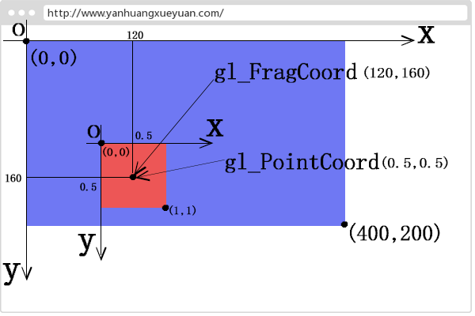
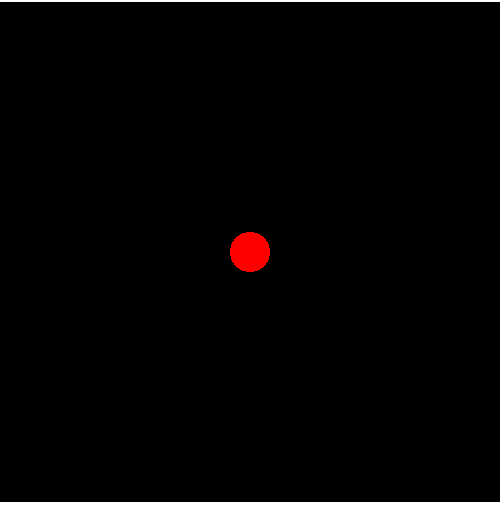

## 1、内置变量
|  内置变量   | 含义  | 值数据类型
|  ----  | ----  | ----
| gl_PointSize  | 点渲染模式，正方形点区域渲染像素大小 | float
| gl_Position  | 顶点位置坐标 | vec4
| gl_FragColor  | 片元颜色值 | vec4
| gl_FragCoord  | 片元坐标，单位像素 | vec2
| gl_PointCoord  | 点渲染模式对应点像素坐标 | vec2
### 1、gl_PointSize
内置变量 `gl_PointSize` 主要是用来设置顶点渲染出来的方形点像素大小。值是一般是在绘制函数 `gl.drawArrays()` 绘制模式是点模式 `gl.POINTS` 的时候使用。
```js
void main() {
  //给内置变量gl_PointSize赋值像素大小，注意值是浮点数
  gl_PointSize=10.0;
}

//绘制函数绘制模式：点gl.POINTS
/*
gl.POINTS表示绘制类型，0表示从第1个数据开始绘制，4表示绘制4个点
*/
gl.drawArrays(gl.POINTS,0,4);
```
### 2、gl_Position
`gl_Position` 内置变量表示最终传入片元着色器片元化要使用的顶点位置坐标。如果有多个顶点，每个顶点都要执行一遍顶点着色器主函数`main` 中的程序。
```js
attribute a_posotion;
void main(){
    //逐顶点处理数据
    gl_Position = apos;
}
```
**顶点传递数据**
```js
const aposLocation = gl.getAttribLocation(program,'a_posotion');
//类型数组构造函数Float32Array创建顶点数组
const data=new Float32Array([0.5,0.5,-0.5,0.5,-0.5,-0.5,0.5,-0.5]);
//创建缓冲区对象
const buffer=gl.createBuffer();
//绑定缓冲区对象,激活buffer
gl.bindBuffer(gl.ARRAY_BUFFER,buffer);
//顶点数组data数据传入缓冲区
gl.bufferData(gl.ARRAY_BUFFER,data,gl.STATIC_DRAW);
//缓冲区中的数据按照一定的规律传递给位置变量apos
gl.vertexAttribPointer(aposLocation,2,gl.FLOAT,false,0,0);
//允许数据传递(这句代码放在能获取到aposLocation的任意位置都可以)
gl.enableVertexAttribArray(aposLocation);
```
### 3、gl_FragColor
`gl_FragColor` 内置变量主要用来设置片元像素的颜色，出现的位置是片元着色器语言的 `main` 函数中。
```js
  void main() {
    // 设置片元颜色为红色
    gl_FragColor = vec4(1.0,1.0,0.0,1.0);
  }
```
**纹理采样**
```js
// 接收插值后的纹理坐标
varying vec2 v_TexCoord;
// 纹理图片像素数据
uniform sampler2D u_Sampler;
void main() {
  // 采集纹素，逐片元赋值像素值
  gl_FragColor = texture2D(u_Sampler,v_TexCoord);
}
```
### 4、gl_PointCoord
渲染点片元坐标。一个顶点渲染为一个正方形区域，每个正方形区域以正方向区域的左上角建立一个直角坐标系，然后使用内置变量`gl_PointCoord` 描述正方形区域中像素或者说片元的坐标，比如正方形区域的左上角坐标是 `(0.0,0.0`),正方形区域几何中心坐标是 `(0.5,0.5)`，右下角坐标是`(1.0,1.0)`。 图片来源于网络



**`gl_PointCoord` 在片元着色器中的应用** 
```js

precision lowp float;
void main(){
    float r = distance(gl_PointCoord, vec2(0.5, 0.5));
    //根据距离设置片元
    if(r < 0.5){
        // 正方形区域片元距离几何中心半径小于0.5，像素颜色设置红色
        gl_FragColor = vec4(1.0,0.0,0.0,1.0);
    }else {
        // 正方形区域距离几何中心半径不小于0.5的片元剪裁舍弃掉：
        discard;
    }
}
```
下面是使用 `gl_pointCoord`裁剪成 **圆形** 的图片和没有被裁减的 **正方形** 的图片对比情况。
<div style='text-align:center'>

</div>

### 5、gl_FragCoord


## 2、enable
用于启用各种功能。功能由参数决定。与 `disable` 相对应。`disable` 是用来关闭的。两个函数参数取值是一至的。参数主要有以下这些：
```js
gl.DEPTH_TEST：启用深度测试。
根据坐标的远近自动隐藏被遮住的图形
gl.CULL_FACE：启用隐藏图形材料的面
gl.BLEND：激活片元的颜色融合计算
```

