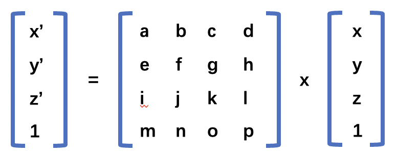

## 1.三维透视投影的定义

正射投影看到的物体都是按照近大远小的规则来呈现的。与模型跟观察者的距离有直接的关系。
这种近大远小的效果就赋予了模型深度感，或者称之为**透视感**。

**透视投影，可视范围是一个棱锥体盒子，下面是透视投影的可视范围的示意图。**


## 2.视锥体的定义
**透视投影，可视范围是一个视锥体**，定义视锥体时会用到以下参数：
+ 视角`（Field of View, FOV`）：垂直视角的角度。
+ 宽高比`（AspectRatio）`：视口的宽高比 `width/height`。
+ 近平面`（Near Plane, zNear）`：距离相机最近的平面。
+ 远平面`（Far Plane, zFar）`：距离相机最远的平面。

## 3推导步骤
#### 3.1定义视角参数
视角参数包括视角 `（FOV）`、宽高比`（aspectRatio`）、近平面`（zNear）`和远平面`（zFar）`。
+ `θ` 为视角的一半，即 `θ = FOV/2`
+ `t = zNear * tan(θ)` 为近平面的高度的一半 `height/2`
+ `r = t*aspectRatio = zNear * tan(θ) * aspectRatio` 为近平面的宽度的一半 `wight/2`

#### 3.2 透视投影矩阵的推导

透视投影矩阵的推导包括将三维点映射到二维平面上，并进行**透视除法**以实现透视效果。

接下来我们将推导一下**透视投影**的矩阵是如何得到的。

假设模型中有一个点`p(x,y,z)`表示像素坐标,投影到近平面后的坐标为`p'(x',y',z')`，表示投影坐标。
首先我们需要找出 `p`和 `p'`之间的关系。`p`和`p'`之间的关系可以用如下矩阵来表示。



上面的矩阵运算后可以得到下面的计算结果。

```js
x' = ax + by + cz + d
y' = ex + fy + gz + h
z' = ix + jy + kz + l
1  = mx + ny + oz + p
```

根据上面的透视投影的示意图，我们根据相似三角形原理，可以得到如下公式。

#### 1. **x' 和 x 的关系**
将`x` 坐标从 `[-r,r]` 变换到 `[-1,1]` 之间。根据相似三角形可以得到下面的计算公式。
```js
x'/(width/2) = x/zNear => 
x'/r = x/n
x' = x*(n/r) 

```
#### 2. **y' 和 y 的关系**


#### 3. **z' 和 z 的关系**

```js
zNear/z = y1/y = x1/x  
```
根据上面的等式，可以得到下面的等式
```js
x1 = zNear*x/z
y1 = zNear*y/z
```
其中 `x1`和`y1` 是相机坐标系下的坐标(非裁剪坐标系下的坐标)经过视线看向物体后在近平面上的交点坐标。，所以我们还需要将 `x1`和`y1`变换到 `[-1，1]` 之间。
```js
x' = x1/(width/2) = (2*zNear*x)/(z*width)
y' = y1/(height/2) = (2*zNear*y)/(z*height)
```

从上面的表达式我们可以发现，`x'` 和 `y'` 不仅和投影面的宽度(`width`)和高度(`height`)有关系，还和 `z` 轴坐标有关系。
`z` 轴坐标越大，`x'` 和 `y'` 越小，也就产生了近大远小的效果，如果我们将齐次坐标 `w `分量设置为 `z`，此时 `x'` 和 `y'` 的值为。


最终我们得到的透视投影矩阵如下所示。


未完待续。


