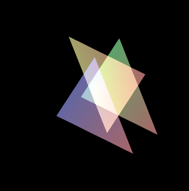

## 1.如何实现a融合
指通过颜色值中的`a`分量来控制颜色的透明度。如果物体是透明的，是可以看到物体背后的其他物体的。
+ 开启混合功能
```js
gl.enable(gl.BLEND);
```
+ 指定混合函数
```js
gl.blendFunc(gl.SRC_ALPHA,gl.ONE_MINUS_SRC_ALPHA)
```

我们通过设置顶点的透明度以及开启混合和设置混合函数，可以看到物体的颜色跟之前完全不一样了。


[a混合demo]('./demo/a混合.html')

## 2.混合函数
在进行`a`混合时，会用到了两个颜色，源颜色和目标颜色，前者是**待混合进去**的颜色，后者是**待被混合进去**的颜色。

比如我们先绘制了一个三角形，然后在这个三角形之上又绘制了一个三角形，如果有重叠的我操作，就会设计混合操作。需要把后者的颜色混入到前者中，后者的颜色就是源颜色，前者的颜色就是目标颜色。

`gl.blendFunc(src_factor,dst_factor)`函数用于指定混合因子,混合因子不一样，最终的效果也会不一样。最终的计算公式如下所示：
```js
混合后颜色 = 源颜色 * src_factor + 目标颜色*dts_factor
```

**加法混合** 会使被混合的区域更加明亮，一般用来实现爆炸的光照效果，或者游戏中需要引起玩家注意的任务物品。

## 3.半透明物体的绘制

注意在绘制半透明物体的时候，需要将开启深度测试的代码关闭掉，这是因为`a`混合发生在绘制片元的过程中，当隐藏面消除功能开启时面，被隐藏的片元不会被绘制，所以也不会发生混合过程，所以就不会出现半透明的效果。
```js
  // Set the clear color and enable the depth test
  gl.clearColor(0.0, 0.0, 0.0, 1.0);
//   gl.enable(gl.DEPTH_TEST);
  // Enable alpha blending
  gl.enable (gl.BLEND);
  // Set blending function
  gl.blendFunc(gl.SRC_ALPHA, gl.ONE_MINUS_SRC_ALPHA);
  // gl.blendFunc(gl.SRC_ALPHA, gl.ONE);
```
半透明的效果图如下所示


## 4.透明与不透明物体共存

关闭英藏面消除功能是一个粗暴的解决方案，在绘制三维场景时，不透明和透明的物体都会有，所以肯定不能关闭隐藏面消除的功能，不然那些不透明物体前后关系会很混乱。不过我们可以通过下面的机制，来同时实现隐藏面消除和半透明效果。具体步骤如下所示：
+ 开启隐藏面消除功能
```js
gl.enable(gl.DEPTH_TEST)
```
+ 绘制所有不透明物体`(a=1)`
+ 锁定用于进行隐藏面消除的深度缓冲区的写入操作，使之只读。
```js
gl.depthMask(false)
```
+ 绘制所有半透明的物体`(a!=1)`，注意应当按照深度顺序排序，然后从后往前绘制。
+ 释放深度缓冲区，是指可读可写。
```js
gl.depthMask(true)
```
部分代码如下所示
```js
....
function draw(gl, n, u_ModelViewMatrix) {
      //设置底色
    gl.clearColor(0.0, 0.0, 0.0, 1.0);
    //1. 开启隐藏面功能
    gl.enable(gl.DEPTH_TEST);
    //开启混合功能
    gl.enable(gl.BLEND);
    //指定混合函数
    gl.blendFunc(gl.SRC_ALPHA, gl.ONE_MINUS_SRC_ALPHA);
    //设置视角矩阵的相关信息（视点，视线，上方向）
    var viewMatrix = new Matrix4();
    viewMatrix.setPerspective(10.0, canvas.width / canvas.height, 1.0, 100.0);
    viewMatrix.lookAt(0.0, g_eyeY, 10.0, 0, 0, 0, 0, 1, 0);
    //设置模型矩阵的相关信息
    var modelMatrix = new Matrix4();
    modelMatrix.setRotate(g_eyeX, 0, 1, 0);

    //计算出模型视图矩阵 viewMatrix.multiply(modelMatrix)相当于在着色器里面u_ViewMatrix * u_ModelMatrix
    var modeViewMatrix = viewMatrix.multiply(modelMatrix);

    //将试图矩阵传给u_ViewMatrix变量
    gl.uniformMatrix4fv(u_ModelViewMatrix, false, modeViewMatrix.elements);

    gl.clear(gl.COLOR_BUFFER_BIT | gl.DEPTH_BUFFER_BIT);
    // 2. 绘制不透明的物体
    //绘制所有不透明的物体
    gl.drawArrays(gl.TRIANGLES, 0, 3);
    // 3.锁定深度缓冲区
    //锁定用于进行隐藏面消除的深度缓冲区的写入操作，使之只读
    gl.depthMask(false);
    // 4. 绘制透明的物体
    //绘制透明的
    gl.drawArrays(gl.TRIANGLES, 3, 6);

    //5. 释放深度缓冲区，使之可读可写
    gl.depthMask(true);
}
```


[透明和不透明物体共存demo](./demo/透明与不透明的物体共存.html)